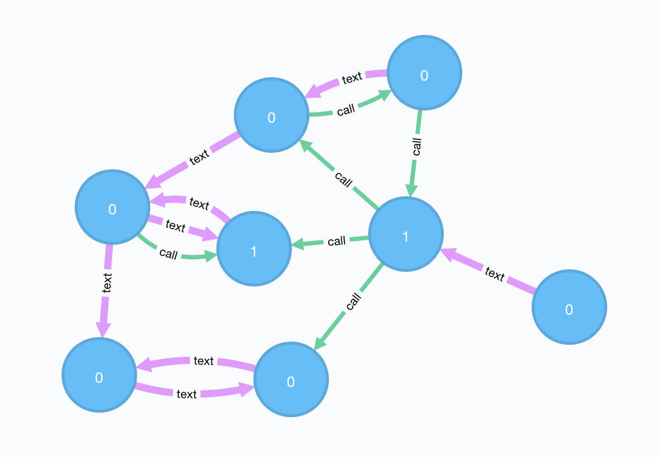

# graph playground
Showing how easy to find interesting connections in graphs and how people often are defined over the social network they live in.

Starting out with neo4j (for small graphs) I subsequently will explore big data technologies (spark, flink) to address graph analytics at scale.

## problem description
There is a graph of a social network of people communicating with each other either via phone call or per text message. Some of the people are terrorists. I want to find out how close the other people are to the terrorists i.e. if the data suggests that there might be an additional hidden terrorist.



**queries**
Starting out simple calculating the fraudulence for each user in the network and ignoring the type of connection or directedness I want to include not only the direct connections but consider the network up to 3 levels deep into the graph, directedness of edges and type of edges and return the following values as a table:

```
Vertex | FraudulenceNetwork | OwnFraudulence | type_Fraudulence
1      | someValue i.e. 0.8.|       1        | undirected_1_level_no_type_of_connection
...
```
